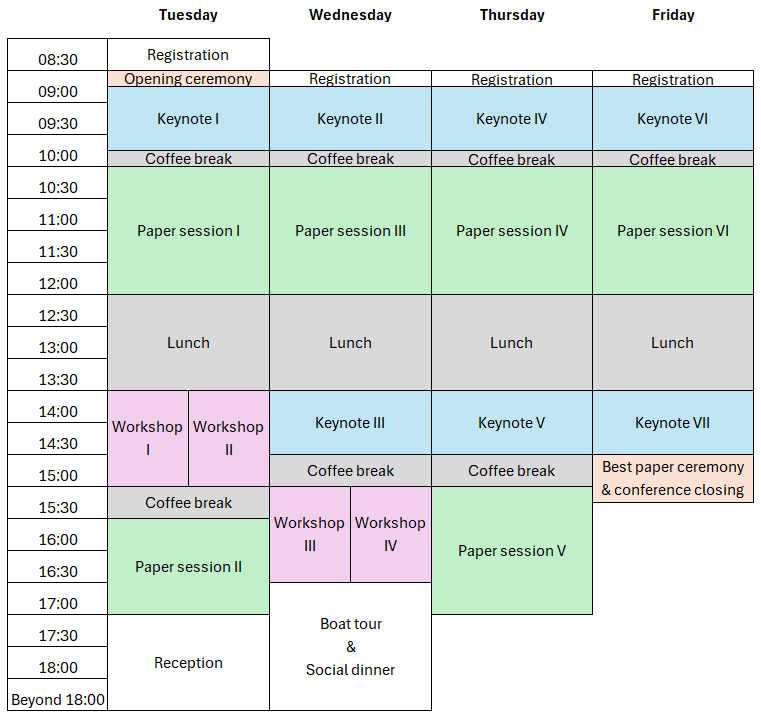

### Program at a Glance

### Detailed Program
#### Day 1 :: Tuesday, August 19, 2025
**8:30 -- 9:00**: Registration

**9:00 -- 9:15**: Opening remarks

**9:15 -- 10:15**: Keynote I

Session Chair: Yod Samuel Martin Garcia

[Nicolás E. Díaz Ferreyra](./../keynotes#nicolas): Privacy as Practice: Perspectives from Users and Developer-Centred Research

**10:15 -- 10:30**: Coffee break

**10:30 -- 12:30**: Paper session I
* *Laura Macpherson*: Sovereignty.exe: The EU’s Digital Dilemma
* *Sargam Gupta and Vicenç Torra*: Fed-PUP : Federated Learning with Personalized User Privacy
* *Giovanni Chieco*: Digital Sovereignty in the Age of Big Tech: A Possible Pathway for the European Union Beyond Regulatory Activism?
* *Derya Sözen Esen*: Toward a Unified Meta-Framework for AI Auditing: A PRISMA Scoping Review of Post-2023 Governance Frameworks and Blind Spots

**12:30 -- 14:00**: Lunch break

**14:00 -- 15:30**: Workshops
* Workshop I: *Ramona Adair, Ina Schiering and Tom Lorenz*: Privacy Awareness Cards
* Workshop II: *Kai Rannenberg et al.*: The CyberSecPro approach to training in Cybersecurity and its relation to Privacy and Identity Management

**15:30 -- 16:00**: Coffee break

**16:00 -- 17:30**: Paper session II
* *Ricardo Bochnia, Eric Biele, Daniel Richter and Jürgen Anke*: Onboarding Processes of Trusted Actors in Self-Sovereign Identity Ecosystems
* *Karl Koch*: œSign: Qualified Collaborative eSignatures
* *Jakob Heher, Emanuel Pichler and Stefan More*: Genuine PDF Forgeries

**17:30**: Welcome reception

#### Day 2 :: Wednesday, August 20, 2025
**9:00 -- 9:15**: Registration

**9:15 -- 10:15**: Keynote II

Session Chair: Joachim Meyer

*[Agnieszka Kitkowska](../keynotes#agnieszka)*: What We Assume, What We Miss: Rethinking How We Understand and Design for Privacy

**10:15 -- 10:30**: Coffee break

**10:30 -- 12:30**: Paper session III
* *Christina Karakosta, Lian Alhedaithy and William J. Knottenbelt*: Scalable Privacy-Preserving Iris Recognition: Challenges and Outlook
* *Halid Kayhan*: Post-hoc Explainability in AI-enabled Clinical Decision Support Systems: Enhancing Shared Decision-Making or Raising New Risks
* *Meem Arafat Manab and Victor Gonzalez Castro*: Private Information is Language Knowledge: GDPR Compliance, Privacy Rights, and the Catastrophe of Systematic Linguistic Degradation
* *Jan Lühr, Foivos Ioannis Michelinakis and Tarik Cicic*: Private Microsegmentation for Smart Homes

**12:30 -- 14:00**: Lunch break

**14:00 -- 15:00**: Keynote III

Session Chair: Laura Drechsler

*[Andrej Savin](../keynotes#andrej)*: Navigating AI and Data Privacy: Clarifying the Relationship between the AI Act and GDPR 

**15:00 -- 15:30**: Coffee break

**15:30 -- 17:00**: Paper session IV
* *Frederick Gaß*: Tensions between the Data Act and the GDPR within the Use of IoT Products
* *Nicola Leschke*: Engineering Personal Data Access: A Procedural Perspective on Challenges and Solutions
* *Yuwen Zhang and Michael Friedewald*: Theory and Practice of Data Portability A Systematic Literature Review 

#### Day 3 :: Thursday, August 21, 2025
**9:00 -- 9:15**: Registration

**9:15 -- 10:15**: Keynote IV

Session Chair: Yod Samuel Martin Garcia

*[Katherine Quezada Tavárez](../keynotes#katherine)*: Building Bridges in Privacy and Data Protection: A Practitioner’s Tale of Interdisciplinary Work

**10:15 -- 10:30**: Coffee break

**10:30 -- 12:30**: Paper session V
* *Maria Skwarcan*: Pay or Consent Under the DMA: Genuine Progress or Illusory Victory Against Data Commodification?
* *Lelia Hanslik, Stefan Ullrich and Bettina Berendt*: From Advertised Features to Third Party Privacy Impact Assessments
* *Nikolas Wintering and Nils Aschenbruck*: Towards a Privacy-aware Role-based Network Intrusion Detection System

**12:30 -- 14:00**: Lunch break

**14:00 -- 15:00**: Keynote V

Session Chair: Lejla Islami

*[Paul Stankovski Wagner](../keynotes#paul)*

**15:00 -- 15:30**: Coffee break

**15:30 -- 17:00**: Workshops
* Workshop III: *Michael Friedewald, Marc Steen and Greta Runge*: Citizen Engagement in Cybersecurity Research
* Workshop IV: *Gurvirender Tejay and Umit Cali*: Connected Vehicles and Digital Privacy: An Applied Workshop using IEEE Digital Privacy Model

**after the end of the last session**: Boats tour and social dinner

#### Day 4 :: Friday, August 22, 2025
**9:00 -- 9:15**: Registration

**9:15 -- 10:15**: Keynote VI

Session Chair: Laura Drechsler

*[Anja Moller Pedersen](../keynotes#anja)*:  Facial Recognition Technology for Law Enforcement Purposes in Denmark: Parliamentary Support Without Democratic Legitimacy

**10:15 -- 10:30**: Coffee break

**10:30 -- 12:30**: Paper session VI
* *Isabela Maria Rosal*: Private actors processing data for archival purposes: a fight for public interest
* *Neshe Tuna and Ala Sarah Alaqra*: Bridging the Cybersecurity Gap: Agile Approaches in Multi-stakeholder Collaboration in the Public Sector
* *Metehan Gelgi, Maria Papaioannou and Nicola Dragoni*: Toward Cost-Effective Secure Multi-Site Connectivity: Evaluating NSA’s CSfC-Compliant Open-Source and Commercial Solutions
* *Jed Boufaied and Vicenç Torra*: On Explanations And Privacy: An AIT Approach

**12:30 -- 13:00**: Best paper ceremony & closing remarks

**13:00 -- 14:00**: Lunch break

